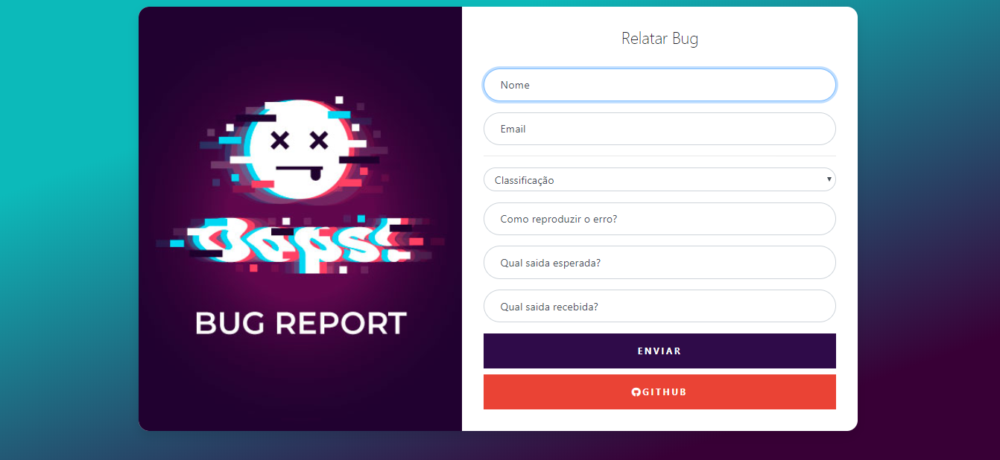
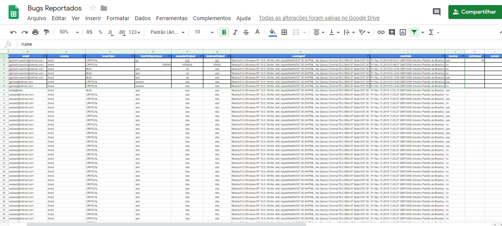

# Bug Report
[![NPM Version][npm-image]][npm-url]
[![Build Status][travis-image]][travis-url]
[![Downloads Stats][npm-downloads]][npm-url]

bug reporting system, the application sends email to the system manager if it is a critical bug, and googlespreadsheet is used

## Live

[https://lab.gabriel984.now.sh/](https://bugreport.now.sh/)

## Integrated with GoogleSpreadSheet

## Release History

* 0.0.1
    * Work in progress

## Meta

Gabriel Mussolini – gabrielmussolini@hotmail.com

[https://github.com/gabrielmussolini984](https://github.com/gabrielmussolini984?)

<!-- Markdown link & img dfn's -->
[npm-image]: https://img.shields.io/npm/v/datadog-metrics.svg?style=flat-square
[npm-url]: https://npmjs.org/package/datadog-metrics
[npm-downloads]: https://img.shields.io/npm/dm/datadog-metrics.svg?style=flat-square
[travis-image]: https://img.shields.io/travis/dbader/node-datadog-metrics/master.svg?style=flat-square
[travis-url]: https://travis-ci.org/dbader/node-datadog-metrics